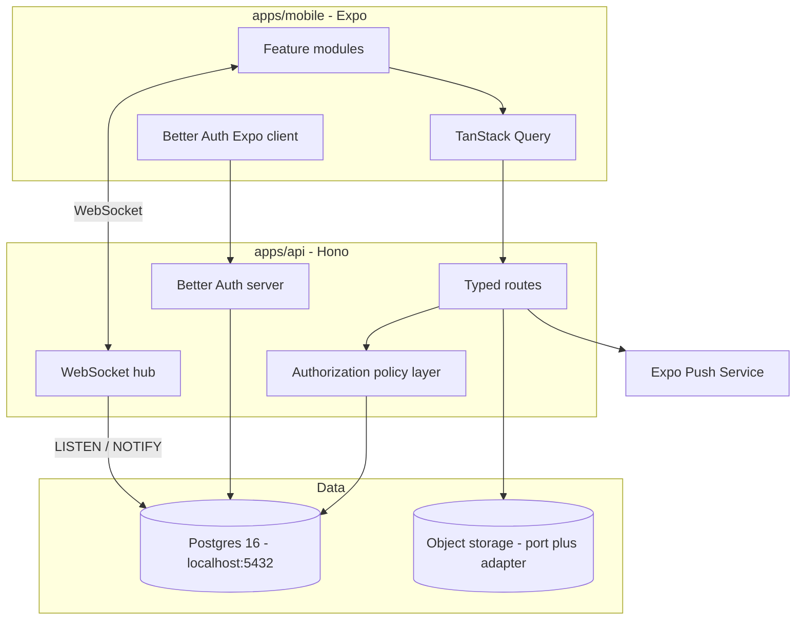

# LunchMeet v2 Rebuild

Baseline is the analysis in [LunchMeet.arch.md](../../LunchMeet.arch.md). Three findings drive the whole design: authorization was never enforced server-side, the database could not be rebuilt from the repo, and there were no tests, CI, or error reporting.

## Stack (decided: Option A)

- **Client** — Expo / React Native, kept and restructured by feature. Expo Router stays.
- **API** — Hono v4.12 on Node. Tiny, Web Standards based, and exports an RPC type the Expo client imports directly, so a route signature change surfaces as a client-side type error.
- **ORM** — Drizzle. Schema is TypeScript with no codegen step, and `drizzle-kit generate` emits numbered SQL migration files. This is the direct fix for "the database is not reproducible."
- **Auth** — Better Auth v1.6, MIT and self-hosted, with a Drizzle adapter and a first-class Expo plugin (`@better-auth/expo`) that handles the OAuth deep-link handshake and SecureStore.
- **Database** — your local Postgres 16.14 on `localhost:5432`.
- **Object storage** — Google Cloud Storage, behind a narrow storage port. See below.

The tradeoff accepted with Hono over NestJS is that you own more architecture decisions rather than inheriting them from the framework. Phase 0 sets those conventions once so later phases are mechanical.

## Target architecture



Repo layout:
- `apps/mobile` — the existing Expo app, reorganized by feature instead of by layer
- `apps/api` — Hono, Better Auth, WebSocket hub
- `packages/db` — Drizzle schema and versioned migrations
- `packages/shared` — Zod schemas and domain types used by both sides
- `packages/config` — the source catalogue: every external dependency and every environment variable, declared once

## Source catalogue

This is the antidote to v1's worst structural habit. The analysis found configuration scattered across at least seven places: `.env`, `eas.json` (with the Supabase URL and key committed), `app.config.js` (whose `extra` block silently falls back to reading `eas.json`'s *development* env), `src/utils/proxyUrl.ts` (a four-level fallback chain ending in a hardcoded `localhost:8787`), `ngrok-tunnels.yml`, `render.yaml`, and the untracked `.cf-*` tunnel URL files. Nothing was validated, and nothing failed loudly when missing.

`packages/config` becomes the single source of truth, with three artifacts generated from one declaration:

- **`env.ts`** — a Zod schema for every variable, split into `serverEnv` (secrets: `DATABASE_URL`, `BETTER_AUTH_SECRET`, `GOOGLE_PLACES_API_KEY`, S3 credentials, SMTP, Sentry DSN) and `publicEnv` (safe to bake into the client bundle: API base URL, WebSocket URL). Parsed once at process boot; on failure the API exits with a list of exactly which variables are missing or malformed rather than failing later with an undefined value.
- **`catalog.ts`** — a typed registry of every external dependency, each entry declaring its id, purpose, which env vars it needs, where its credentials live, its dev and prod endpoints, and a health-check function. Current entries: Postgres, object storage, SMTP, Google Places, Expo Push, Sentry.
- **Generated outputs** — `.env.example` and a human-readable `docs/CATALOG.md`, both emitted from the declarations by a script and checked in CI so they cannot drift from reality.

Two mechanisms make this stick rather than becoming another place to forget:

- `apps/api` reads config only through `packages/config`. A raw `process.env` reference anywhere else fails lint.
- `app.config.js` derives its `extra` block from `publicEnv` at build time instead of duplicating values into `eas.json`. This kills v1's silent development-config-in-production-builds fallback at the root.

The catalogue also gives the `doctor` behaviour v1 never had: one command that walks every registry entry, runs its health check, and reports what is reachable and what is misconfigured.

Its provisioning counterpart is [ops/PRODUCTION_SECRETS.md](../../ops/PRODUCTION_SECRETS.md): a values-free inventory of every production credential, where to obtain it, which of the four secret stores it belongs in (API host env, EAS secrets, GitHub Actions secrets, EAS credentials store), and how to rotate it. CI checks its variable names against `catalog.ts` so the two cannot drift.

It deliberately lives in `ops/` rather than `docs/`, because `.github/workflows/github-pages.yml` uploads `path: docs` wholesale to GitHub Pages — a secrets manifest placed there would be served as a live public web page.

## v1 config corrections (Phase 0, on `v2` only)

`main` keeps describing exactly what is on the store, so these land on the `v2` branch:

- **App name mismatch** — the store lists **LunchMeet Social**; `app.config.js` sets `name: "LunchMeet"`. Align to the store name.
- **Empty `production` EAS profile** — currently `{}` while `PUBLISH_IOS_APP_STORE.md` instructs building with it. Populate it explicitly rather than relying on `app.config.js` silently falling back to the *development* env block in `eas.json`.
- **Missing `NSPhotoLibraryUsageDescription`** — `expo-image-picker` runs on the Profile tab with no iOS purpose string declared. This is an App Review rejection risk.
- **Android Maps key has no fallback** — `app.config.js:45-49` reads `process.env.GOOGLE_PLACES_API_KEY` only; without it the whole `googleMaps` block is omitted and native maps break in release builds.
- **Dangling script references** — `postinstall`, `prestart`, and `prebuild` all invoke `scripts/write-config.js`, which does not exist, so a clean `npm install` fails its lifecycle hook. `start-expo-tunnel` points at a missing `.ps1` as well.

All of these are eventually superseded by `packages/config`, but they get fixed on the way through so the branch is never knowingly broken.

## Live README metrics

Verified against the public iTunes Lookup API for app `6760374356`:

- **Available now** — `averageUserRating` and `userRatingCount`, plus current-version variants. Rendered as shields.io dynamic JSON badges that query Apple directly, needing no CI job and no secrets.
- **Not publicly available** — download and install counts appear in no field of the public API. They require App Store Connect Sales and Trends reports authenticated with an Issuer ID, Key ID, and `.p8` key, delivered as delayed gzipped TSV. Deferred indefinitely.
- **Deferred to Phase 2** — profiles created needs a public `GET /v1/public/stats` route on the Hono API before anything can read it. Publishing it is also a deliberate choice, since the number will be small and public.

## Object storage — Google Cloud Storage

**Decided: GCS**, on existing operational familiarity. For a solo maintainer that outweighs marginal technical differences between providers — you will be debugging IAM at some point, and knowing the console matters more than benchmark deltas.

Three consequences:

- **Use the native `@google-cloud/storage` SDK, not S3 interop.** Interop exists mainly to ease migration off S3 and is explicitly not a perfect clone. Native gives proper V4 signed URLs and, more importantly, a better credential story: a service account attached to the workload instead of long-lived HMAC keys.
- **Keep the storage port, ship one adapter.** The port survives because it is four methods and it lets unit tests run against an in-memory fake rather than a live bucket. The S3 and Azure adapters are dropped from scope until something actually needs them — building all three now would be speculative.
- **Dev uses `fake-gcs-server`** in `docker-compose.dev.yml`, so the adapter exercised in development is the one that runs in production. This closes the testing gap flagged in the previous revision rather than carrying it forward.

Port surface: `presignUpload(key)`, `presignDownload(key)`, `delete(key)`, `head(key)`.

Objects are keyed under a per-user prefix so paths are scoped by owner. This is the direct fix for v1's storage policies, which let any authenticated user update or delete any object in the `profile-photos` bucket.

**MinIO is dropped** regardless: its repository is now marked unmaintained, the admin console was removed from the community edition in May 2025, community distribution is source-only with no pre-compiled binaries, and it is AGPLv3.

### Hosting: GCP, decided later

GCP is the intended production cloud, but the specific services — Cloud Run versus GKE, Cloud SQL versus a managed Postgres such as Neon — are deliberately deferred to Phase 8. Two rules keep that choice open:

- Nothing in Phases 0 through 7 may couple to a host-specific API. The API is a plain Node process reading configuration through the source catalogue, which runs anywhere.
- **Local development needs no GCP account at all.** `fake-gcs-server` requires no credentials, so Phases 0 through 7 can be built and tested entirely offline. Real GCS credentials are needed only when something is actually deployed.

One design note to carry into Phase 8: if the API ends up on Cloud Run, GKE, or Compute Engine, attach a service account to the workload and skip `GCP_SERVICE_ACCOUNT_JSON` entirely, letting Application Default Credentials resolve it. A downloaded JSON key is long-lived, cannot be rotated without a redeploy, and is the most common cause of compromised GCP projects.

## Key decisions baked in

- **Authorization is a server-side policy layer.** Every route resolves the caller's relationship to the lunch (host, co-host, accepted attendee, none) before touching data. `is_public`, and the `visibility_gender` / `visibility_looking_for` filters that v1 never implemented at all, become server-side query predicates. Nothing private ever leaves the API.
- **Realtime without a vendor.** Postgres `LISTEN`/`NOTIFY` fans out to a WebSocket hub for chat and notifications. No broker, no extra service.
- **Scheduled work lives in the API, not the database.** v1 ran the rating-prompt job through `pg_cron`, where it was invisible to tests and error reporting. Moving it into the API process makes it testable, observable, and versioned with the code.
- **Configuration is declared once.** The source catalogue in `packages/config` replaces the seven scattered config locations v1 accumulated, and fails loudly at boot instead of silently falling back.
- **Push notifications via `expo-notifications` + Expo Push Service.** v1 had none, which is a real product gap for time-sensitive invitations.
- **Photos move to object storage.** v1 stored base64 data URIs in `profiles.photos`, inflating every profile query by megabytes.

## Database (ready)

The prerequisite is satisfied. Verified over TCP, not just through the extension:

- `lunchmeet_dev` connects to database `lunchmeet_dev` on `localhost:5432`, Postgres 16.14
- The database is empty (no relations), so Phase 1 starts from a clean slate
- The role has `CREATE` on schema `public` and can create schemas, which is everything `drizzle-kit migrate` needs

The connection string is declared once, in `packages/config`, and read from a gitignored `.env`:

```
DATABASE_URL=postgresql://lunchmeet_dev:<password>@localhost:5432/lunchmeet_dev
```

> Rotate this password before it reaches anything real. It was typed in chat and in a screenshot, so treat it as a local-dev-only credential. v1's analysis flagged committed credentials as a finding, and the fix is to keep this in a gitignored `.env` from the first commit rather than retrofitting later.

The Cursor PostgreSQL extension connection is useful alongside this for browsing tables and eyeballing migration results.

### Extensions (installed and verified)

`lunchmeet_dev` is now a superuser, and these are created in the `lunchmeet_dev` database:

- **`citext` 1.6** — case-insensitive email uniqueness. A cleaner answer than v1's `LIKE`-based `search_users_by_email`. Verified: `'Test@Example.COM' = 'test@example.com'` returns true.
- **`pg_trgm` 1.6** — trigram fuzzy matching for user and restaurant search.
- **`cube` 1.5 + `earthdistance` 1.2** — indexed geo-distance for nearby-lunch queries, replacing the hand-rolled haversine SQL from an earlier revision. Verified: the `<@>` operator returns 111.5 miles for Los Angeles to San Diego.
- **`pgcrypto` 1.3** — available if needed, though `gen_random_uuid()` is built into Postgres 13+ so primary keys need nothing.

These were created by hand to unblock and verify. **Phase 1's first migration must still declare all of them with `CREATE EXTENSION IF NOT EXISTS`** — otherwise we reproduce v1's original sin of schema objects that exist in one database and in no migration file. The hand-created state is a convenience, not the source of truth.

Two caveats to carry forward:

- **The production role must not be a superuser.** This grant is a local-dev convenience only.
- Because migrations will issue `CREATE EXTENSION`, the production database needs these pre-created by an administrator, or the deploy fails on a non-superuser role. The catalogue records them as required infrastructure so provisioning is documented rather than discovered at deploy time.

### PostGIS and pg_cron: deliberately not installed

Both are available in Ubuntu noble/universe (`postgresql-16-postgis-3` 3.4.2, `postgresql-16-cron` 1.6.2) but neither is installed, and the plan does not need either:

- **PostGIS** is superseded by `cube` + `earthdistance` for this workload. It is worth revisiting only if geo requirements grow beyond radius search into polygons, routing, or projections.
- **pg_cron** is superseded by the in-process API scheduler. Beyond the apt package it also requires adding `shared_preload_libraries = 'pg_cron'` to `postgresql.conf` and restarting the cluster, which would drop connections to every other database on this shared instance.

## Scope note

This is a large rebuild. Phases 0-2 establish the foundation and are where the security findings actually get fixed; treat those as the first milestone and reassess before continuing.
